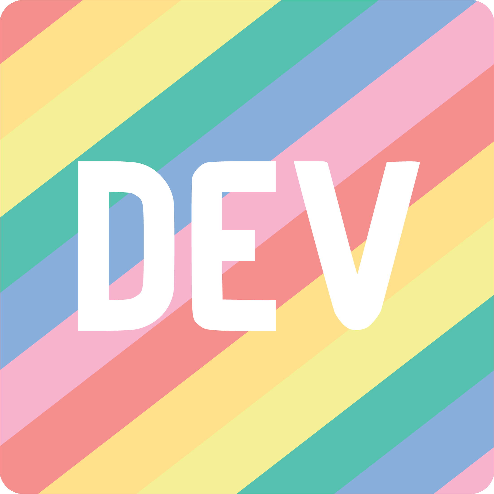

<!-- Profile README for https://github.com/AnimeshPandey · mirrors https://anmshpndy.com -->
<h1 align="center">Hi, I'm Animesh Pandey</h1>

  <strong>Senior Frontend Engineer</strong> · React · TypeScript · Next.js · Microfrontends · Agentic UI

  Bangalore, India · <strong>Open to senior &amp; staff frontend roles</strong> (remote-friendly)

  
  
  
  

  
  
  
  
  
  
  

 

  I ship interfaces that survive <strong>real data</strong>: marketing intelligence dashboards, microfrontend platforms for <strong>50k+ daily users</strong>, and <strong>agentic AI</strong> products with streaming UX — not bolt-on chatbots.

  

---

### Now

| | |
|---|---|
| **Role** | Senior Software Engineer @ [**Lifesight**](https://lifesight.io) (marketing intelligence SaaS) |
| **Focus** | Unified Measurement OS · SSR analytics · **Mia** (agentic AI) · LLM streaming UI · Playwright &amp; perf in CI |
| **Previously** | [**Tekion**](https://tekion.com) — Module Federation across 10+ modules, design system, 30% load-time wins |
| **Before** | [**Vassar Labs**](https://vassarlabs.com) — GovTech dashboards (Kerala-WRIS, geospatial viz) |

---

### What I build

  
  
  
  
  
  
  
  
  
  
  

**7+ years** across SaaS analytics, automotive retail, and GovTech · **8+ engineers mentored** · IIITDM Jabalpur

---

### Selected work

Full case studies, recruiter mode, and contact on the **[portfolio](https://anmshpndy.com)**.

| Project | Highlights |
|---------|----------------|
| [**Microfrontend architecture**](https://anmshpndy.com/#projects) | Webpack Module Federation · 50k+ DAU · 30% faster loads · 10+ squads |
| [**Mia — agentic AI UI**](https://anmshpndy.com/#projects) | LLM streaming · tool-call panels · measurement data layer |
| [**Marketing intelligence dashboards**](https://anmshpndy.com/#projects) | MMM · incrementality · Next.js SSR · Core Web Vitals in CI |
| [**Enterprise design system**](https://anmshpndy.com/#projects) | 20+ components · Storybook · WCAG 2.1 |
| [**Performance CI guard**](https://anmshpndy.com/#projects) | Lighthouse CI · Playwright previews · PR budget comments |
| [**Kerala-WRIS (GovTech)**](https://anmshpndy.com/#projects) | Leaflet · Highcharts · D3 · statewide water dashboards |

**Open source &amp; site repo:** [**AnimeshPandey.github.io**](https://github.com/AnimeshPandey/AnimeshPandey.github.io) — static portfolio (HTML/CSS/JS, GitHub Pages, 6 themes, i18n-ready patterns)

---

### Writing

Technical posts on JavaScript, frontend at scale, and calm agent UI — **[anmshpndy.com/#writing](https://anmshpndy.com/#writing)**

| | |
|---|---|
| **Latest on site** | [Streaming Agent UI Without the Chatbot Clipart](https://anmshpndy.com/streaming-agent-ui-without-chatbot-clipart/) |
| **Series** | [Fundamentals of Functional JavaScript](https://anmshpndy.com/fundamentals-of-functional-javascript/) · [`this` binding](https://anmshpndy.com/how-well-do-you-know-this/) |
| **Elsewhere** | [HackerNoon](https://hackernoon.com/u/anmshpndy) · [Medium](https://anmshpndy.medium.com/) · [Dev.to](https://dev.to/anmshpndy) |

---

### GitHub

  
  

  

---

  
    <a href="https://anmshpndy.com/#contact">Get in touch</a> ·
    <a href="https://anmshpndy.com/resume.pdf">Resume</a> ·
    <a href="https://github.com/AnimeshPandey">More repos</a>
  

  

